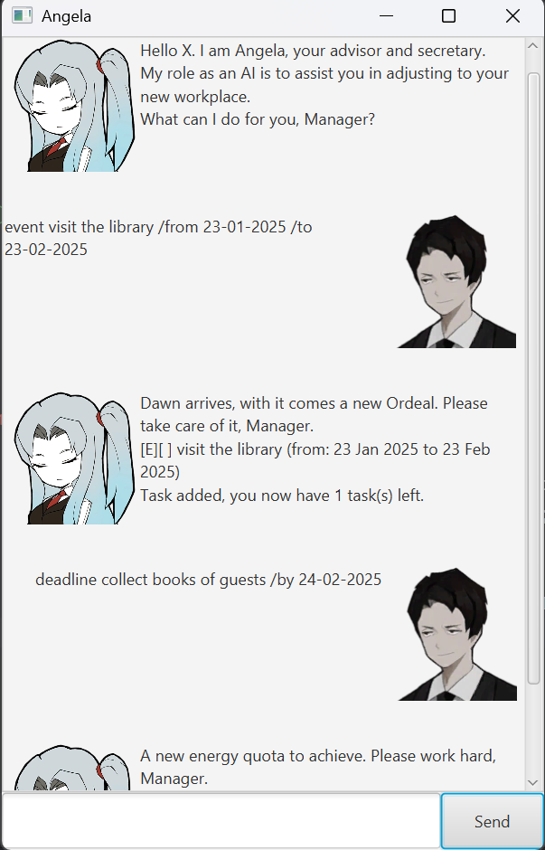

# Angela User Guide



> Hello X. I am Angela, your advisor and secretary.

Based on Project Moon's [Lobotomy Corporation](https://store.steampowered.com/app/568220/Lobotomy_Corporation__Monster_Management_Simulation/),
Angela is an advanced ~~human~~ AI whose role is to guide you through your tasks just as she did in Lobotomy Corporation.

As an advanced AI developed under one of the Wings of the City, Angela is able to help you organise your tasks, allowing
you to store all your tasks in one place with the ability to mark them as done or delete them as your see fit!

# Commands
CAPITALIZED text represent arguments, substitute them with the necessary information.

/slashes represent additional parameters. Their arguments can be in any order.
## Listing
### List 
Lists the tasks added. _The details of abnormalities are all written in the compendium._

Command format: `list`

Output: The list of tasks, with the task type, status and relevant time information.
```
1. [T][ ] Germinate the Seed of Light within 50 days
2. [D][ ] Generate 1590 Enkaphalin boxes (by: 23 Feb 2025)
3. [E][ ] Suppress the Queen of Hatred (from: 23 Jan 2025 to 23 Feb 2025)
```

### Find
Finds and lists all tasks that contain the given keyword. _How can I find my reason to live? 
Revenge is all I've ever known._

Command format: `find QUERY`
- The query is case-sensitive.

Example Usage: `find Suppress`

Output: The added task +  The amount of tasks left
```
Save your thanks. Such a task is trivial for an AI like me.
1. [E][ ] Suppress the Queen of Hatred (from: 23 Jan 2025 to 23 Feb 2025)
```

## Adding tasks
### Todos 
Tasks that have to be done, sooner or later. _Eventually, pain always catches up to you._

Command format: `todo TASKNAME`

Example Usage: `todo Germinate the Seed of Light within 50 days`

Output: The added task +  The amount of tasks left
```
Did the Sephira give you a new task again?
[T][ ] Germinate the Seed of Light within 50 days
Task added, you now have 3 task(s) left.
```

### Deadlines
Tasks that need to be done before a date. _Its similar to the ever-increasing energy quotas that you chase after._

Command format: `deadline TASKNAME /by DATE`
- `DATE` should follow the format `DD-MM-YYYY`.

Example Usage: `deadline Generate 1590 Enkaphalin boxes /by 23-02-2025`

Output: The added task +  The amount of tasks left
```
A new energy quota to achieve. Please work hard, Manager.
[D][ ] Generate 1590 Enkaphalin boxes (by: 23 Feb 2025)
Task added, you now have 2 task(s) left.
```

### Events
Tasks that happen within a certain period. _Unlike the 50 days you've been through, they do not repeat._

Command format: `event TASKNAME /from DATE /to DATE`
- `DATE` should follow the format `DD-MM-YYYY`.

Example Usage: `event Suppress the Queen of Hatred /from 23-01-2025 /to 23-02-2025`

Output: The added task +  The amount of tasks left
```
Dawn arrives, with it comes a new Ordeal. Please take care of it, Manager.
[E][ ] Suppress the Queen of Hatred (from: 23 Jan 2025 to 23 Feb 2025)
Task added, you now have 3 task(s) left.
```
## Marking Tasks
### Mark
Marks a task as done. _Completing tasks from the Sephirah puts you one step closer to the Seed of Light._

Command format: `mark INDEX`
- The index is based on the index given using the `list` command.

Example Usage: `mark 2`

Output: The task marked as done.
```
Exceptional work Manager. The task has been marked as done.
[D][X] Generate 1590 Enkaphalin boxes (by: 23 Feb 2025)
```
### Unmark
Marks a task as not done. _Restarting the day before it ends does not progress your tasks. Sacrifice is inevitable._

Command format: `unmark INDEX`
- The index is based on the index given using the `list` command.

Example Usage: `unmark 2`

Output: The task marked as not done.
```
More work for the Manager. The task has been undone.
[D][ ] Generate 1590 Enkaphalin boxes (by: 23 Feb 2025)
```

## Deletion
### Delete 
Deletes a task from the list. _The City is an unforgiving place, offices and fixers disappear into the wind every day._

Command format: `delete INDEX`
- The index is based on the index given using the `list` command.

Example Usage: `delete 2`

Output: The deleted task + The amount of tasks left.
```
As tonight, again the stars are brushed away by the wind.
[D][ ] Generate 1590 Enkaphalin boxes (by: 23 Feb 2025)
Task removed, you now have 2 task(s) left.
```

### Undo
Undoes the last action that modifies the task list. _Time loses its meaning with every reset. Life and death will soon 
follow._

Command format: `undo`
- Commands affected include `todo`, `deadline`, `event`, `delete`, `mark`, `unmark` and any meaningful `undo`.
- An `undo` run after `list` and `find` will instead undo the previous action.

Output: The task list after the undo
```
Time has been rewound to the memory repository.
The current task list is as follows:
1. [T][ ] Germinate the Seed of Light within 50 days
2. [D][ ] Generate 1590 Enkaphalin boxes (by: 23 Feb 2025)
3. [E][ ] Suppress the Queen of Hatred (from: 23 Jan 2025 to 23 Feb 2025)
```